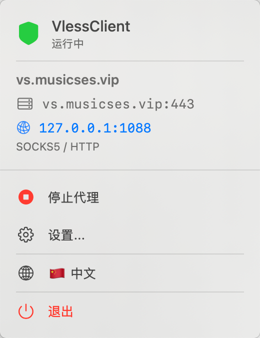
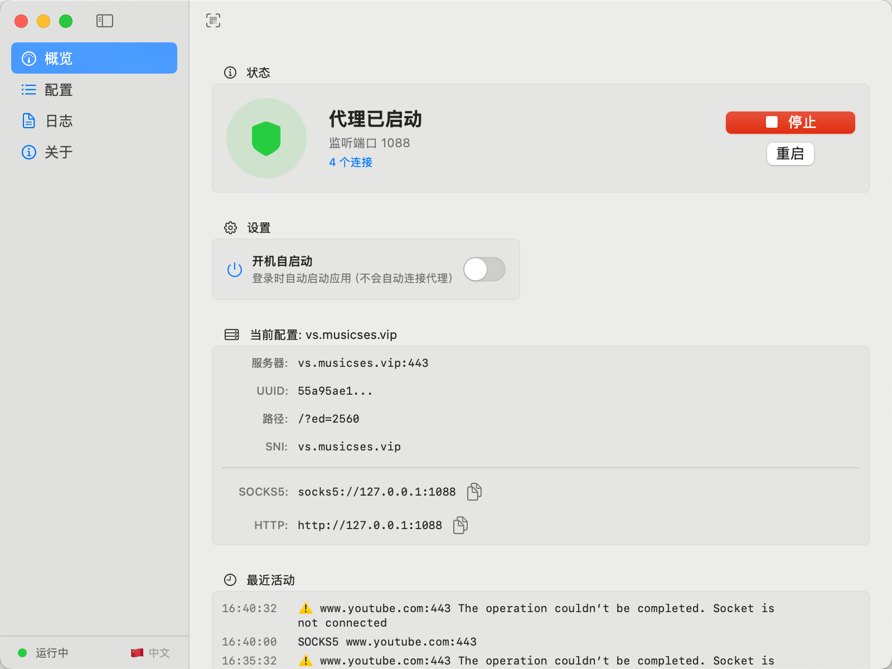

# VlessClient Xcode Project

This directory contains a complete Xcode project for the VlessClient macOS app.

 

## Setup Instructions

---

## ✨ Features

- 🛡️ **VLESS Protocol** - Full support for VLESS WebSocket transport
- 🔄 **Dual Proxy** - SOCKS5 and HTTP proxy on single port
- 🎨 **Native UI** - Beautiful SwiftUI interface with menu bar support
- 🌐 **Bilingual** - English and Chinese language support
- 🚀 **Auto-reconnect** - Intelligent reconnection on network changes
- 🔐 **TLS Support** - Secure connections with optional certificate validation
- 📋 **Multi-config** - Manage multiple server configurations
- 🎯 **Easy Import** - Import servers via `vless://` URI

## 📸 Screenshots

### Dashboard
Clean and intuitive dashboard showing connection status and proxy information.

### Configuration Management
Beautifully designed card-based configuration list with quick actions.

### Menu Bar Access
Quick proxy control from menu bar without opening the main window.

## 🚀 Installation

### Option 1: Build from Source

1. **Prerequisites**
   - macOS 15.7 or later
   - Xcode 16.0 or later
   - Apple Developer account (for code signing)

2. **Clone & Build**
   ```bash
   git clone https://github.com/liseipi/VlessClient.git
   cd VlessClient
   open VlessClient.xcodeproj
   ```

3. **Configure Signing**
   - Select your development team in Xcode
   - Build and run (⌘R)

### Option 2: Download Release

Download the latest `.app` from [Releases](https://github.com/liseipi/VlessClient/releases) page.

## 📖 Usage

### Basic Setup

1. **Add Server Configuration**
   - Click "Import VLESS" or "Add" button
   - Paste your `vless://` URI or manually enter details
   - Save the configuration

2. **Start Proxy**
   - Select a configuration and click "Use"
   - Click the "Start" button
   - Configure your system/browser to use:
      - SOCKS5: `127.0.0.1:1088`
      - HTTP: `127.0.0.1:1088`

3. **Menu Bar Control**
   - Access quick controls from menu bar icon
   - Start/stop proxy without opening main window
   - View current server status

### Configuration Format

**VLESS URI Example:**
```
vless://uuid@server:port?encryption=none&security=tls&sni=example.com&type=ws&host=example.com&path=/path#ConfigName
```

**Manual Configuration:**
- Server: `your-server.com`
- Port: `443`
- UUID: `xxxxxxxx-xxxx-xxxx-xxxx-xxxxxxxxxxxx`
- Path: `/?ed=2560`
- Security: `tls` / `none`
- SNI: Server name for TLS
- Listen Port: `1088` (local proxy port)

## 🛠 Development

### Project Structure

```
VlessClient/
├── ContentView.swift           # Main UI views
├── VlessConfig.swift           # Configuration model & URI parser
├── VlessHeaderBuilder.swift    # VLESS protocol header builder
├── VlessTunnel.swift           # WebSocket tunnel manager
├── ProxyServer.swift           # TCP listener & connection dispatcher
├── Socks5Connection.swift      # SOCKS5 protocol handler (legacy)
├── HttpProxyConnection.swift   # HTTP proxy handler (legacy)
├── ConfigManager.swift         # Configuration persistence
├── Localizable.swift           # Internationalization
└── Info.plist                  # App configuration
```

### Key Technologies

- **SwiftUI** - Modern declarative UI framework
- **Network.framework** - Apple's native networking stack
- **URLSession** - WebSocket connections
- **Combine** - Reactive programming
- **UserDefaults** - Configuration storage


## 📄 License

This project is licensed under the MIT License - see the [LICENSE](LICENSE) file for details.

## 👤 Author

**liseipi**

- Website: [www.musicses.com](https://www.musicses.com)
- GitHub: [@liseipi](https://github.com/liseipi)

## 🙏 Acknowledgments

- VLESS protocol specification
- Apple Network.framework documentation
- SwiftUI community
